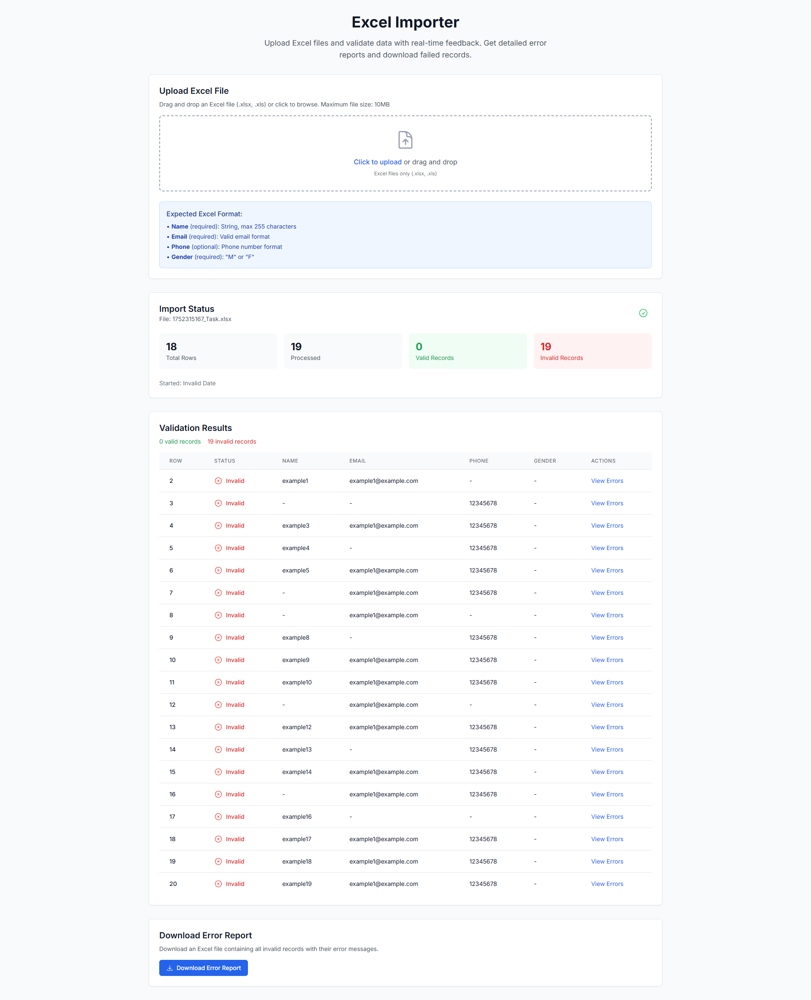
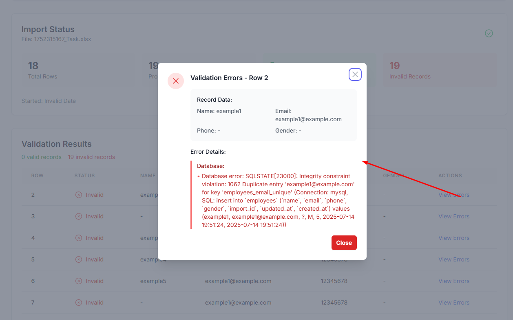

# TBM System Task

## Overview

This project is a full-stack web application consisting of a Laravel (PHP) backend and a Next.js (React) frontend. It is designed to manage employee data imports and related operations.


## Directory Structure

```
Task -1/
  backend/    # Laravel backend (API, database, business logic)
  frontend/   # Next.js frontend (UI, client-side logic)
```

---

## Backend (Laravel)

- **Location:** `backend/`
- **Framework:** Laravel (PHP)
- **Key Features:**
  - RESTful API for employee data import and management
  - Database migrations, seeders, and models
  - Authentication and middleware
  - Excel import functionality

### Setup (Backend)
1. Navigate to the backend directory:
   ```sh
   cd backend
   ```
2. Install dependencies:
   ```sh
   composer install
   ```
3. Copy the example environment file and configure your environment variables:
   ```sh
   cp .env.example .env
   # Edit .env as needed
   ```
4. Generate application key:
   ```sh
   php artisan key:generate
   ```
5. Run migrations:
   ```sh
   php artisan migrate
   ```
6. (Optional) Seed the database:
   ```sh
   php artisan db:seed
   ```
7. Start the development server:
   ```sh
   php artisan serve
   ```

---

## Frontend (Next.js)

- **Location:** `frontend/`
- **Framework:** Next.js (React)
- **Key Features:**
  - File upload and import status UI
  - Data table for imported records
  - Error handling and modals

### Setup (Frontend)
1. Navigate to the frontend directory:
   ```sh
   cd frontend
   ```
2. Install dependencies:
   ```sh
   npm install
   # or
   yarn install
   ```
3. Start the development server:
   ```sh
   npm run dev
   # or
   yarn dev
   ```

---

## Usage

1. Start both backend and frontend development servers.
2. Access the frontend in your browser (usually at `http://localhost:3000`).
3. Use the UI to upload employee data files and monitor import status.

---


---

## Demo Screenshot



---

## Contribution Guidelines

1. Fork the repository and create a new branch for your feature or bugfix.
2. Follow PSR-12 (PHP) and standard JavaScript/React coding conventions.
3. Submit a pull request with a clear description of your changes.

---

## License

This project is for educational and demonstration purposes. Add a license if you intend to open source it. 